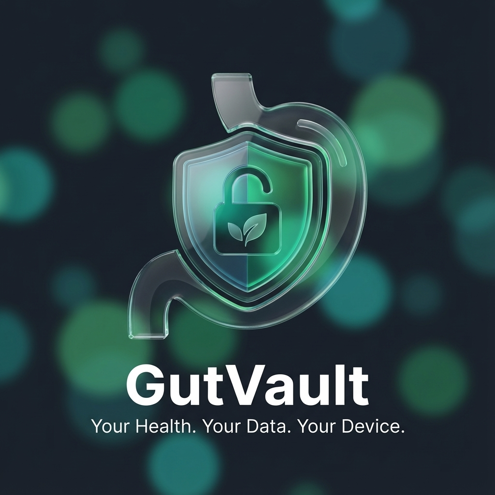

# GutVault

<div align="center">




**A privacy-first, offline-ready IBS tracker featuring AI voice logging and local-first architecture.**

<p align="center">
  <a href="#-overview">Overview</a> •
  <a href="#-features">Features</a> •
  <a href="#-tech-stack">Tech Stack</a> •
  <a href="#-getting-started">Getting Started</a>
</p>

</div>

---

## 📖 Overview

GutVault is a Progressive Web Application (PWA) designed to simplify the tracking of Irritable Bowel Syndrome (IBS) symptoms, meals, and bowel movements. Unlike traditional health trackers that store sensitive medical data on remote servers, GutVault utilizes a **local-first architecture**.

All user data is stored persistently within the user's browser using **IndexedDB** (via Dexie.js), ensuring complete privacy and offline functionality. The application leverages **AI Voice Logging** to reduce the friction of manual entry. Users can speak naturally to describe their meals or symptoms, and the application uses an LLM (via OpenRouter) to parse the speech into structured data points automatically.

---

## ✨ Features

- **🛡️ Local-First Storage:** 100% of health data is stored locally on the device using IndexedDB (Dexie.js). Includes a **Storage Quota** view to track your data usage.
- **🎙️ Multi-Language AI Voice Logging:** - Speak naturally in **16+ languages** (English, Greek, Spanish, French, etc.).
  - **Review Mode:** Verify AI-parsed data against your raw transcript before saving to ensure accuracy.
  - Automatically extracts: Foods, Symptoms, Bristol Stool Scale, Pain Levels, and Medications.
- **🔔 Daily Reminders:** Built-in browser notifications to remind you to log your symptoms at a specific time every day.
- **📝 Comprehensive Manual Logging:** - **Bowel Movements:** Interactive Bristol Stool Scale visuals (Types 1-7).
  - **Symptoms:** Intensity sliders (1-10) with dynamic color coding and emoji indicators.
  - **Meals:** Tag trigger foods (Gluten, Dairy, etc.) alongside free text.
  - **Medications:** Track names and dosages.
- **🧠 Smart Correlations:** - Looks ahead 24 hours from every meal to detect associations with high pain or irregular bowel movements.
  - **Trigger Probability:** Visual bar charts showing the likelihood of specific foods causing symptoms.
- **🔍 Advanced History Management:** - Filter logs by **Date Range**, **Bristol Type**, or **Text Search** (find specific notes or foods).
  - Edit or delete any entry.
  - **Pagination** for smooth performance with large datasets.
- **📊 Dashboard Insights:**
  - **At a Glance:** Time since last BM, daily log count, and current pain level.
  - **Pain Trends:** 7-day interactive area chart.
- **💾 Import/Export:** - Full JSON backup and restore.
  - **PDF Reports:** Generate readable reports for your doctor (supports UTF-8 characters/Greek via custom font embedding).
  - **🩺 Doctor Sharing Mode:** Specialized export with:
    - **Trend Charts:** Visual Bristol Stool Scale and Symptom Frequency graphs.
    - **Smart Filtering:** Last 30/60/90 days view.
    - **Privacy:** Option to hide personal notes from the report.
- **📶 Offline PWA:** Installable on iOS/Android, fully functional without internet (sync required only for AI voice parsing).

---

## ⚡ Tech Stack

| Category       | Technology          | Description                                  |
| :------------- | :------------------ | :------------------------------------------- |
| **Framework**  | **Next.js 16**      | App Router, React 19, Server Actions.        |
| **Database**   | **Dexie.js**        | IndexedDB wrapper for local-first storage.   |
| **AI & API**   | **Vercel AI SDK**   | AI integration via OpenRouter.               |
| **Styling**    | **Tailwind CSS v4** | Next-gen utility CSS engine with shadcn/ui.  |
| **Animations** | **Framer Motion**   | Smooth transitions and interactive elements. |
| **Validation** | **Zod**             | Type-safe runtime schema validation.         |
| **Charts**     | **Recharts**        | client-side data visualization.              |

---

## 🚀 Getting Started

### Prerequisites

- [Node.js](https://nodejs.org/) v20+ or [Bun](https://bun.sh/)
- npm, pnpm, or bun

### Installation

1. **Clone the repository**

   ```bash
   git clone https://github.com/yourusername/gutvault.git
   cd gutvault
   ```

2. **Install dependencies**

   ```bash
   npm install
   # or
   pnpm install
   # or
   bun install
   ```

3. **Configure Environment Variables**
   Create a `.env.local` file in the root directory and add your OpenRouter keys.

   ```bash
   cp .env.example .env.local
   ```

4. **Run the development server**

   ```bash
   npm run dev
   # or
   pnpm dev
   # or
   bun dev
   ```

5. Open [http://localhost:3000](http://localhost:3000) with your browser.

---

## ⚙️ Configuration

The application requires the following environment variables for AI features:

| Variable               | Description                                    | Default                        |
| :--------------------- | :--------------------------------------------- | :----------------------------- |
| `NEXT_PUBLIC_SITE_URL` | The Site URL of the app running in production. | Required                       |
| `OPENROUTER_API_KEY`   | API Key for OpenRouter to access LLMs.         | Required                       |
| `OPENROUTER_MODEL`     | The specific model ID to use for parsing.      | `mistralai/devstral-2512:free` |

---

## 🛠️ Project Structure

```bash
src/
├── app/              # Next.js App Router pages and layouts
│   ├── (app)/        # Main app routes (Dashboard, History)
│   ├── (marketing)/  # Landing page and marketing routes
│   └── api/          # API routes for AI processing
├── features/         # Feature-based architecture
│   ├── dashboard/    # Dashboard components (Charts, At-a-glance)
│   ├── history/      # History list and log rendering
│   ├── logging/      # Voice and manual logging logic
│   ├── settings/     # Settings and data management
│   └── theme-toggle/ # Dark/Light mode logic
├── sections/         # Marketing page sections
├── shared/           # Shared utilities
│   ├── db/           # Dexie.js database configuration
│   ├── lib/          # Utility functions
│   ├── providers/    # Context providers
│   └── ui/           # Reusable UI components
└── widgets/          # Composite UI blocks (Headers, Footers)
```

---

## 🤝 Contributing

Contributions are more than welcome. Please follow these steps:

1. Fork the repository.
2. Create a feature branch (`git checkout -b feature/amazing-feature`).
3. Commit your changes (`git commit -m 'Add some amazing feature'`).
4. Push to the branch (`git push origin feature/amazing-feature`).
5. Open a Pull Request.

---

## 📄 License

Distributed under the MIT License. See `LICENSE` for more information.
